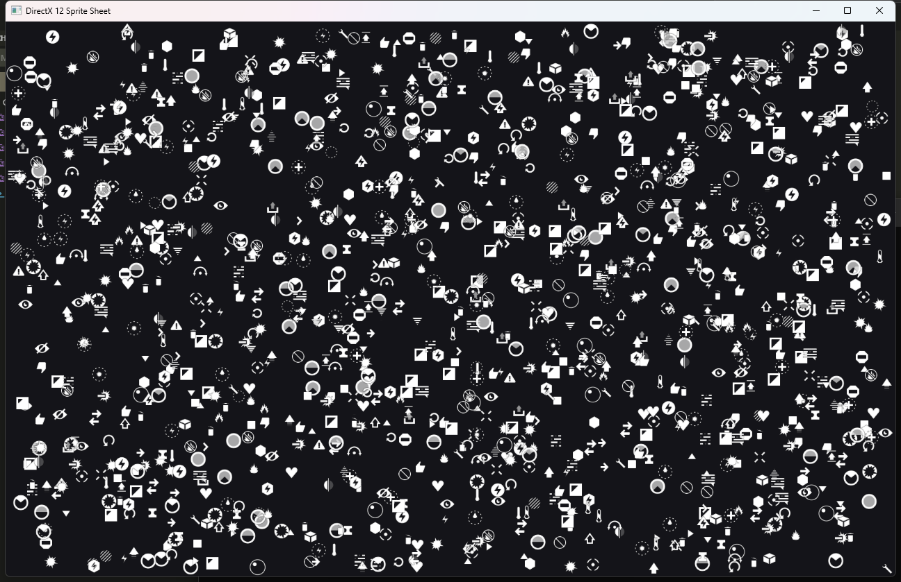

# dx12 - DirectX 12 wrapper for Nim on Windows.

`nimby install dx12`

[API reference](https://treeform.github.io/dx12)

## About

`dx12` is a Windows-focused DirectX 12 wrapper for Nim.
It provides the low-level DXGI and D3D12 types, constants, COM wrappers, and
small context helpers used by the examples in this repository.

The library package itself depends on `windy` for Win32 handle types.
Some examples also depend on sibling graphics libraries such as `pixie` and
`vmath`, which are not required to import the core `dx12` module.

## Documentation

API docs are generated from `src/dx12.nim` by
`.github/workflows/docs.yml`.

## Examples

The `examples/` directory includes:

- Basic triangle and shader examples.
- Textured quad and textured cube examples.
- A sprite sheet batcher example.
- An OBJ viewer example.

The examples are intended for local development in a multi-repo workspace.
See `examples/nim.cfg` for the extra example-only paths used during
development.

### Example Screenshots

#### `basic_screen`

#### `basic_triangle`

#### `basic_quad`

#### `basic_cube`

#### `spritesheet`

#### `viewer_obj`

## Notes

- This project is intended to build and test on Windows.
- The package surface is `import dx12` and `import dx12/context`.
- The `headers/` and `tools/` directories are kept in the repo for wrapper
  maintenance and experiments.
