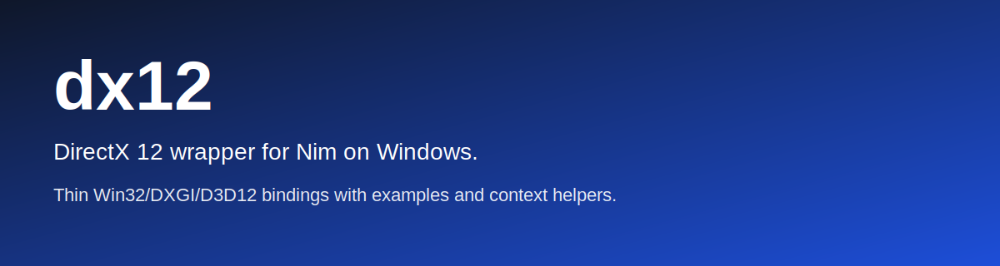
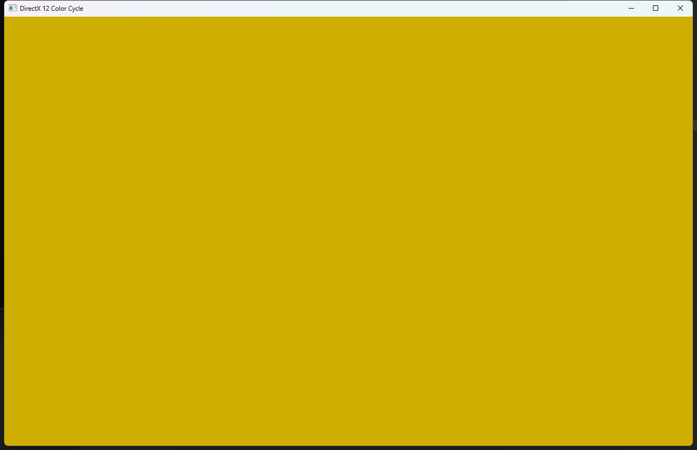
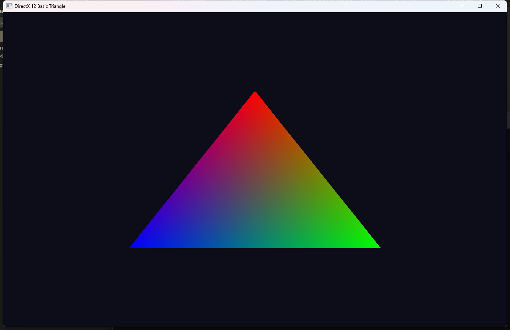
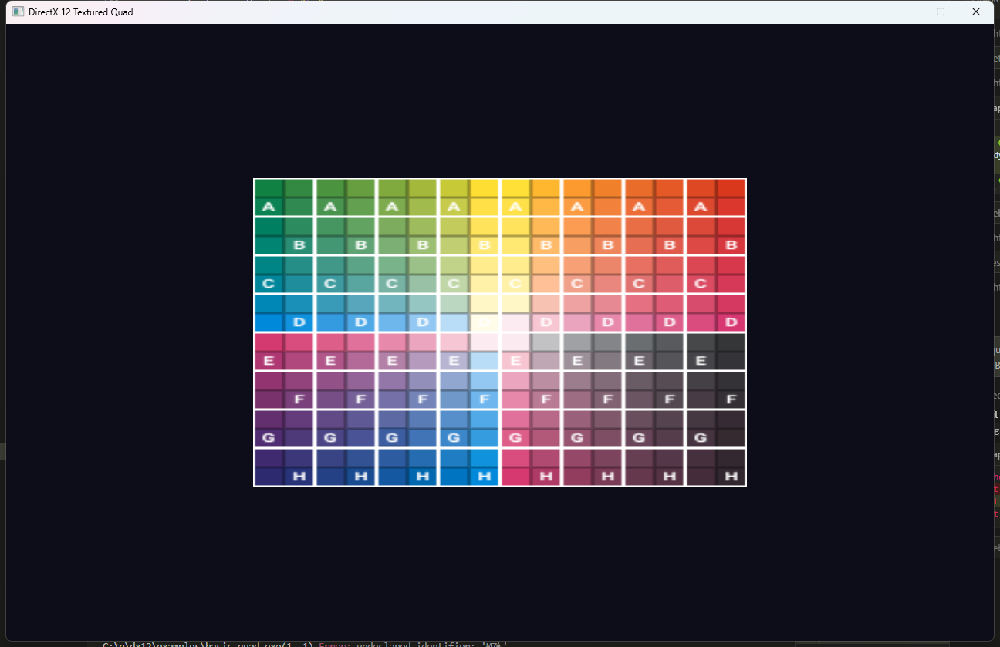
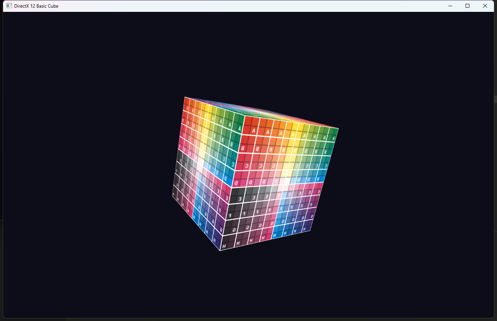
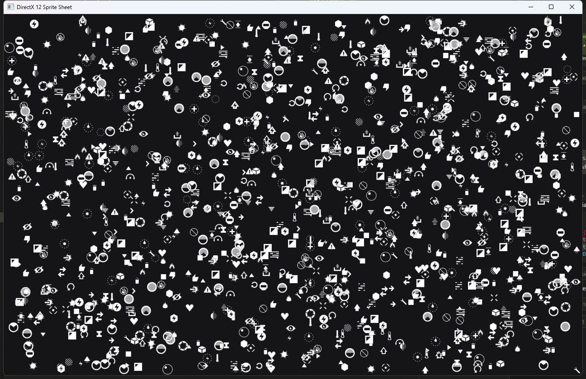
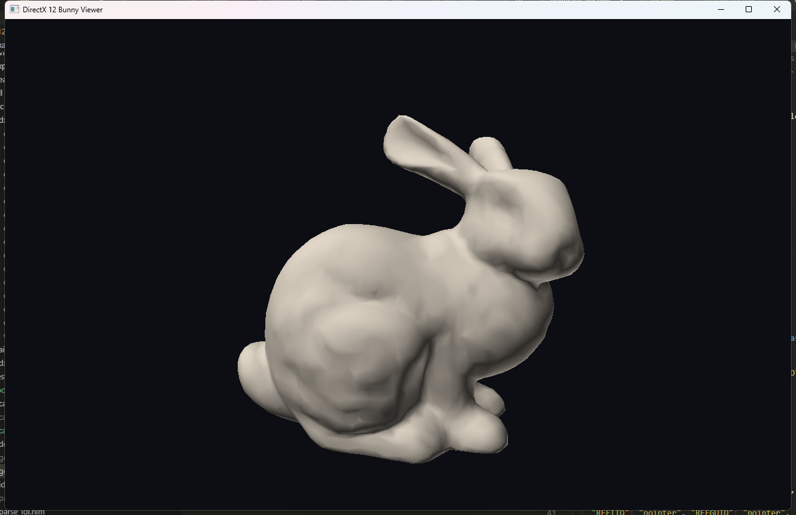

# dx12 - DirectX 12 wrapper for Nim on Windows.

`nimby install dx12`


[API reference](https://treeform.github.io/dx12)

## About

`dx12` is a Windows-focused DirectX 12 wrapper for Nim. It provides the
complete DXGI and D3D12 types, constants, COM interface stubs, vtable method
wrappers, and small context helpers used by the examples in this repository.

The bindings are **generated directly from IDL (Interface Definition Language)
source files** obtained from the Wine project. This ensures that the Nim API
stays accurate to the official COM interface definitions rather than relying on
hand-written translations.

The library package itself depends on `windy` for Win32 handle types. Some
examples also depend on sibling graphics libraries such as `pixie` and `vmath`,
which are not required to import the core `dx12` module.

## How the API is Generated

The Nim bindings are not written by hand. They are generated from Microsoft's
COM interface definitions using a multi-step toolchain. This section describes
the full pipeline from the upstream source definitions to working Nim code.

### Step 1: Downloading IDL Source Files

The authoritative definitions for DirectX 12 and DXGI live in `.idl` (Interface
Definition Language) files. These are the same files that Microsoft's MIDL
compiler uses to generate the C/C++ headers shipped in the Windows SDK. We
obtain them from the [Wine project](https://gitlab.winehq.org/wine/wine), which
maintains a clean-room implementation of these definitions under the LGPL-2.1+
license.

The download tool fetches 12 IDL files from Wine's GitLab repository:

```
nim r -d:ssl tools/download_idl.nim
```

This places the files into the `idl/` directory:

| File | Contents |
|------|----------|
| `dxgicommon.idl` | `DXGI_SAMPLE_DESC`, `DXGI_RATIONAL`, color space enums |
| `dxgiformat.idl` | The complete `DXGI_FORMAT` enum (~115 pixel formats) |
| `dxgitype.idl` | `DXGI_MODE_DESC`, mode rotation/scaling enums |
| `dxgi.idl` | Base DXGI interfaces: `IDXGIFactory`, `IDXGISwapChain`, `IDXGIOutput`, `IDXGIAdapter` |
| `dxgi1_2.idl` | `IDXGIFactory2`, `IDXGISwapChain1`, `DXGI_SWAP_CHAIN_DESC1`, `CreateSwapChainForHwnd` |
| `dxgi1_3.idl` | `IDXGIFactory3`, `IDXGISwapChain2` (inheritance chain) |
| `dxgi1_4.idl` | `IDXGIFactory4`, `IDXGISwapChain3` |
| `dxgi1_5.idl` | `IDXGIFactory5` (tearing support), `DXGI_FEATURE` enum |
| `dxgi1_6.idl` | `IDXGIFactory6`, `IDXGIFactory7`, HDR and GPU preference enums |
| `d3dcommon.idl` | `ID3DBlob`, `D3D_FEATURE_LEVEL`, `D3D_PRIMITIVE_TOPOLOGY` |
| `d3d12.idl` | The main Direct3D 12 API: all D3D12 interfaces, structs, enums, and constants |
| `d3d12shader.idl` | Shader reflection interfaces |

The IDL format is more structured than C headers. Each COM interface carries its
UUID directly in a `uuid(...)` attribute, method parameters are annotated with
`[in]`, `[out]`, or `[in, out]` direction markers, and inheritance is expressed
cleanly as `interface ID3D12Device : ID3D12Object`. This makes IDL significantly
easier and more reliable to parse than the generated `.h` files.

### Step 2: Parsing the IDL

The generic IDL parser lives in `tools/idl.nim`. It reads any `.idl` file and
produces a typed data structure containing:

- **Constants** (`const UINT NAME = value;`)
- **Enums** (`typedef enum { ... } NAME;`) with support for both explicit values and auto-increment members
- **Structs** (`typedef struct { ... } NAME;`) including anonymous unions inside structs
- **COM interfaces** with UUID, base class, and method signatures
- **Typedefs** (simple type aliases like `typedef ID3D10Blob ID3DBlob`)
- **Forward declarations** and **import** statements

A diagnostic tool can be used to verify parsing results:

```
nim r tools/parse_idl.nim
```

This prints a summary of every parsed file showing how many constants, enums,
structs, interfaces, and methods were extracted.

### Step 3: Generating Nim Code

The code generator reads all 12 IDL files through the parser and produces one
Nim source file per IDL file:

```
nim r tools/generate_api.nim
```

Each generated `.nim` file in `src/dx12/` mirrors its corresponding `.idl`:

- `dxgicommon.idl` produces `src/dx12/dxgicommon.nim`
- `dxgiformat.idl` produces `src/dx12/dxgiformat.nim`
- `dxgi.idl` produces `src/dx12/dxgi.nim`
- `d3d12.idl` produces `src/dx12/d3d12_api.nim`
- ... and so on for all 12 files.

The generator also produces `src/dx12.nim`, a switchboard module that imports
and re-exports every generated module plus the hand-written modules. This means
users just write `import dx12` and get everything.

Within each generated file, the content follows this order:

1. **Imports** that mirror the IDL `import` statements (e.g., `dxgi1_4.idl`
   imports `dxgi1_3.idl`, so `dxgi1_4.nim` imports `dxgi1_3`). These are also
   re-exported so that transitive dependencies resolve correctly.
2. **Constants** converted from IDL `const` declarations with appropriate Nim
   type suffixes (`'u32`, `'i32`, `'f32`).
3. **Enum values** where each member becomes a Nim `const`.
4. **Union types** for structs that contain anonymous `union { ... }` blocks.
   These are emitted as `{.union.}` objects with a companion `_union` type name.
5. **Struct types** with fields mapped from C types to Nim types. Structs that
   reference COM interfaces or other structs use the correct Nim types.
6. **COM interface stubs** declared as `ptr object` types. Forward declarations
   are emitted before structs so that struct fields can reference COM types.
7. **Typedefs** emitted after COM stubs so that aliases like `ID3DBlob = ID3D10Blob`
   resolve correctly.
8. **COM method wrappers** for each interface's own methods. Each method becomes
   a Nim proc that calls through the vtable using the `callVtbl` / `callVtblErr`
   templates from `vtable.nim`.

#### Type Mapping

The generator maps C/IDL types to Nim as follows:

| C / IDL Type | Nim Type |
|---|---|
| `UINT`, `ULONG`, `DWORD` | `uint32` |
| `INT`, `LONG` | `int32` |
| `FLOAT`, `float` | `float32` |
| `UINT8`, `BYTE` | `uint8` |
| `UINT16` | `uint16` |
| `UINT64` | `uint64` |
| `SIZE_T` | `csize_t` |
| `BOOL` | `int32` |
| `HRESULT` | `int32` |
| `void *` | `pointer` |
| `REFIID`, `REFGUID` | `pointer` |
| `const char *` | `cstring` |
| Struct pointer (`TYPE *`) | `ptr TYPE` |
| COM interface pointer (`IFoo *`) | `IFoo` (already `ptr object`) |
| Enum types | `uint32` |

#### Vtable Index Computation

COM methods are called through vtable slots. The generator computes the correct
index for each method by walking the inheritance chain:

- `IUnknown` has 3 base methods (QueryInterface, AddRef, Release) at slots 0-2.
- Each derived interface's own methods start after the parent's total method count.
- For example, `ID3D12Object` inherits `IUnknown` (3 methods) and adds 4 own
  methods at slots 3-6. `ID3D12DeviceChild` inherits `ID3D12Object` (7 total)
  and adds 1 method at slot 7.

Methods that return `HRESULT` automatically get error checking: the generated
wrapper raises an exception with the interface name, method name, and HRESULT
value if the call fails.

### Step 4: Hand-Written Extras

A small set of functionality cannot be derived from IDL files. These live in
`src/dx12/extras.nim`, a normal hand-maintained file (not generated):

- **`DXGuid` type and `newGuid` constructor** for COM interface IDs.
- **DLL runtime loading** (`loadNativeSymbols`, `loadCompiler`) that loads
  `d3d12.dll`, `dxgi.dll`, and `d3dcompiler_47.dll` at runtime via `std/dynlib`.
- **Device and factory creation** (`d3d12CreateDevice`, `createDxgiFactory2`)
  that call the loaded DLL entry points with the correct IIDs.
- **Ergonomic IID-wrapping methods** like `createCommandQueue`,
  `createDescriptorHeap`, `createFence`, etc. These embed the COM interface GUID
  and return the created object directly instead of requiring the caller to pass
  a REFIID and output pointer.
- **DXGI SwapChain methods** typed for `IDXGISwapChain3` (`present`, `getBuffer`,
  `resizeBuffers`) since the generated versions are on the base `IDXGISwapChain`
  type and Nim's type system does not support COM inheritance upcasting.
- **Descriptor heap methods** (`getCPUDescriptorHandleForHeapStart`,
  `getGPUDescriptorHandleForHeapStart`) that use a hidden return-pointer ABI
  which the standard vtable calling convention cannot express.
- **Shader compilation helpers** (`compileShader`, `serializeRootSignature`,
  `shaderBytecode`) that wrap the D3DCompiler DLL.
- **QueryInterface upgrade helpers** (`upgradeToSwapChain3`, `upgradeToFactory5`).
- **Extra constants** from `cpp_quote` macros in the IDL that the parser does
  not extract (`DXGI_MWA_NO_ALT_ENTER`, `DXGI_PRESENT_ALLOW_TEARING`,
  `D3D12_DEFAULT_SHADER_4_COMPONENT_MAPPING`, `FRAME_COUNT`, etc.).

Additionally, `src/dx12/context.nim` provides `D3D12Context`, a higher-level
helper that manages device initialization, swap chain setup, command list
recording, fence synchronization, and window resizing. This is used by all the
examples but is not part of the generated API.

### Step 5: Testing with Examples

The `examples/` directory contains six working DirectX 12 applications that
exercise different parts of the generated API:

| Example | What it tests |
|---------|--------------|
| `basic_screen` | Device init, swap chain, clear color, present |
| `basic_triangle` | Vertex buffers, shader compilation, graphics pipeline, draw calls |
| `basic_quad` | Texture loading, SRV descriptors, texture copy, sampler state |
| `basic_cube` | 3D transforms, depth buffer, MSAA, constant buffers, mip-mapped textures |
| `sprite_sheet` | Sprite batching, animated texture atlas, instanced drawing |
| `viewer_obj` | OBJ model loading, indexed drawing, lighting shaders |

These examples serve as integration tests for the generated bindings. When the
generator or IDL parser is modified, recompiling the examples verifies that the
generated types, constants, and method wrappers are correct and that the vtable
indices match the actual COM interfaces.

Screenshots of the examples can be captured automatically using the Nim-based
capture tool:

```
nim c tools/capture.nim
tools/capture.exe examples/basic_screen.exe 3 docs/basic_screen.png
```

This launches the executable, waits for its window to appear, waits a specified
delay (default 3 seconds) for content to render, captures a screenshot via
Win32 API (`BitBlt` from the desktop DC), saves it as PNG using Pixie, and then
kills the process.


## Documentation

API docs are generated from `src/dx12.nim` by `.github/workflows/docs.yml`.

## Examples

### Example Screenshots

#### `basic_screen`



#### `basic_triangle`



#### `basic_quad`



#### `basic_cube`



#### `sprite_sheet`



#### `viewer_obj`



## Notes

- This project is intended to build and test on Windows.
- The package surface is `import dx12` and `import dx12/context`.
- The `idl/` directory contains the upstream IDL source files from Wine (LGPL-2.1+).
- The `tools/` directory contains the download, parsing, generation, and capture utilities.
- The `headers/` directory contains the old C header files kept for reference.
